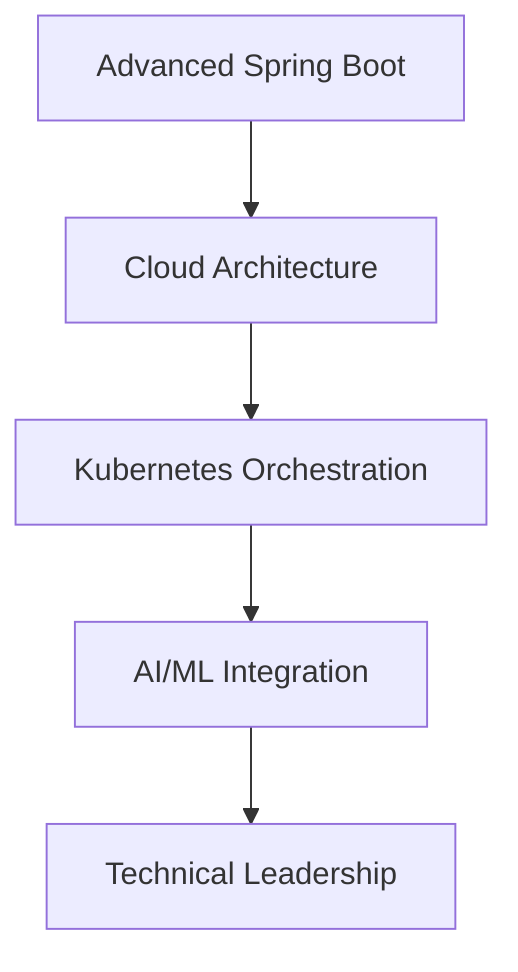

<div align="center">
  
# William Mlula
## Senior Full-Stack Developer


[](https://www.linkedin.com/in/william-mlula-341a98147/)
[](mailto:williammlula4@gmail.com)
[](https://twitter.com/ndeanka)
[](#)


</div>

---

## 📋 Table of Contents
- [👨‍💻 Professional Summary](#-professional-summary)
- [🛠️ Technical Expertise](#️-technical-expertise)
- [📊 GitHub Analytics](#-github-analytics)
- [🏆 Portfolio Projects](#-portfolio-projects)
- [🎯 Current Initiatives](#-current-initiatives)
- [💼 Professional Experience](#-professional-experience)
- [🎓 Certifications & Learning](#-certifications--learning)
- [📬 Professional Contact](#-professional-contact)

---

## 👨‍💻 Professional Summary

<div align="left">

```javascript
const williamMlula = {
    role: "Senior Full-Stack Developer",
    location: "Tanzania",
    experience: "5+ years",
    specialization: ["Angular", "React", "Node.js", "NestJS"],
    architecture: ["Microservices", "Clean Architecture", "Domain-Driven Design"],
    databases: ["PostgreSQL", "MongoDB", "MySQL", "Redis"],
    focus: "Enterprise-grade scalable applications",
    methodology: "Agile/Scrum, Test-Driven Development"
};
```

</div>

**Professional Highlights:**
- 🏢 **Enterprise Application Development** - 5+ years building scalable web applications
- 🏗️ **Full-Stack Architecture** - From frontend interfaces to backend microservices
- 🔧 **Clean Code Implementation** - Advocate for maintainable, testable code practices
- 📚 **Technical Leadership** - Mentoring junior developers and driving best practices
- 🚀 **Performance Optimization** - Expertise in application scaling and optimization

---

## 🛠️ Technical Expertise

<div align="center">

### Frontend Technologies


### Backend & API Development


### Database Systems


### DevOps & Development Tools


</div>

---

## 📊 GitHub Analytics

<div align="center">
  
  
</div>

<div align="center">
  
</div>

---

## 🏆 Portfolio Projects

<div align="center">

| Project | Description | Technology Stack | Status |
|---------|-------------|------------------|--------|
| **Kikoba Financial Platform** | Enterprise savings & loan management system | NestJS, Angular 19, PostgreSQL, Docker | Production |
| **PharmaTrack Management System** | Comprehensive pharmacy inventory solution | React, NestJS, TypeORM, Tailwind CSS | Production |
| **TeamPulse HR Dashboard** | Employee management and analytics platform | Node.js, Express, React, MySQL | Production |

</div>

### Technical Project Details

<details>
<summary><b>Kikoba Financial Platform</b></summary>

**Project Overview:** Enterprise-grade financial management platform for savings and loan operations.

**Technical Implementation:**
- **Architecture:** Microservices with API Gateway pattern
- **Authentication:** JWT-based secure authentication system
- **Database:** PostgreSQL with optimized queries and indexing
- **Frontend:** Angular 19 with reactive forms and state management
- **Deployment:** Docker containerization with CI/CD pipeline

**Key Features:**
- Real-time transaction processing
- Role-based access control
- Audit logging and compliance
- Responsive dashboard interface
- RESTful API design

</details>

<details>
<summary><b>PharmaTrack Management System</b></summary>

**Project Overview:** Complete pharmacy inventory and prescription management solution.

**Technical Implementation:**
- **Backend:** NestJS with TypeORM for database operations
- **Frontend:** React with modern hooks and context API
- **Database:** PostgreSQL with complex relational modeling
- **UI/UX:** Tailwind CSS for responsive design
- **Integration:** Third-party APIs for medication databases

**Key Features:**
- Inventory tracking with automated alerts
- Prescription management system
- Multi-location support
- Reporting and analytics
- Barcode scanning integration

</details>

<details>
<summary><b>TeamPulse HR Dashboard</b></summary>

**Project Overview:** Comprehensive employee management and performance analytics platform.

**Technical Implementation:**
- **Backend:** Node.js with Express.js framework
- **Frontend:** React with data visualization libraries
- **Database:** MySQL with optimized schema design
- **Authentication:** Session-based authentication
- **APIs:** RESTful services with comprehensive documentation

**Key Features:**
- Employee lifecycle management
- Performance tracking and analytics
- Document management system
- Reporting dashboard
- Role-based access control

</details>

---

## 🎯 Current Initiatives

<div align="center">

### Professional Development Roadmap



</div>

**Active Learning Path:**
- **Spring Boot Mastery:** Advanced patterns and microservices architecture
- **Cloud Technologies:** AWS/Azure cloud-native application development
- **Container Orchestration:** Kubernetes for enterprise deployments
- **Machine Learning:** AI integration in web applications
- **Technical Leadership:** Team management and architectural decision-making

**Current Projects:**
- Contributing to open-source Angular ecosystem projects
- Developing enterprise-grade component library
- Technical blog writing on clean architecture principles

---

## 💼 Professional Experience

<div align="center">

### Career Progression

| Skill Domain | Proficiency Level | Years of Experience |
|--------------|-------------------|---------------------|
| **Frontend Development** | Expert ⭐⭐⭐⭐⭐ | 5+ years |
| **Backend Development** | Expert ⭐⭐⭐⭐⭐ | 5+ years |
| **Database Design** | Advanced ⭐⭐⭐⭐ | 4+ years |
| **API Development** | Expert ⭐⭐⭐⭐⭐ | 5+ years |
| **DevOps & CI/CD** | Advanced ⭐⭐⭐⭐ | 3+ years |
| **System Architecture** | Advanced ⭐⭐⭐⭐ | 3+ years |

</div>

### Professional Achievements

- ✅ **100+ Projects** delivered successfully across various industries
- ✅ **Enterprise Applications** deployed to production environments
- ✅ **Team Leadership** experience with junior developers
- ✅ **Clean Code Practices** implementation across all projects
- ✅ **Agile Methodologies** expertise in Scrum and Kanban
- ✅ **Performance Optimization** for high-traffic applications

---

## 🎓 Certifications & Learning

**Continuous Professional Development:**
- Advanced JavaScript and TypeScript patterns
- Clean Architecture and Domain-Driven Design
- Cloud-native application development
- DevOps and CI/CD best practices
- Agile and Scrum methodologies

**Industry Knowledge:**
- Enterprise software development lifecycle
- Scalable system architecture design
- Database optimization and performance tuning
- Security best practices in web applications
- Testing strategies and quality assurance

---

## 📬 Professional Contact

<div align="center">

### Let's Connect Professionally

I'm available for freelance projects, technical consulting, and full-time opportunities.

<table>
  <tr>
    <td align="center">
      <a href="mailto:williammlula4@gmail.com">
        
        <br><b>Professional Email</b>
      </a>
    </td>
    <td align="center">
      <a href="https://www.linkedin.com/in/william-mlula-341a98147/">
        
        <br><b>LinkedIn Profile</b>
      </a>
    </td>
    <td align="center">
      <a href="https://twitter.com/ndeanka">
        
        <br><b>Professional Updates</b>
      </a>
    </td>
  </tr>
</table>

### Professional Services

**Available for:**
- 🏢 **Enterprise Application Development**
- 🔧 **Technical Consulting & Architecture Review**
- 📚 **Code Review & Best Practices Implementation**
- 🎯 **Team Leadership & Mentoring**
- 🚀 **Performance Optimization & Scaling**

**Preferred Engagement:**
- Remote collaboration with flexible scheduling
- Agile development methodologies
- Long-term partnerships and ongoing projects
- Technical challenges requiring innovative solutions

---

<div align="center">

### Professional Recognition


---

**"Clean code always looks like it was written by someone who cares."**  
*— Robert C. Martin*

<br>

*Available for professional opportunities and technical collaborations.*

[](#)

</div>
