<div align="center">
  
# 👋 Hey there, I'm William Mlula


<p align="center">
  
</p>

[](https://www.linkedin.com/in/william-mlula-341a98147/)
[](https://twitter.com/ndeanka)
[](mailto:williammlula4@gmail.com)
[](#)


</div>

---

## 📋 Table of Contents
- [🚀 About Me](#-about-me)
- [🛠️ Tech Stack](#️-tech-stack)
- [📊 GitHub Analytics](#-github-analytics)
- [🏆 Featured Projects](#-featured-projects)
- [🎯 Current Focus](#-current-focus)
- [🌟 Skills & Expertise](#-skills--expertise)
- [📈 Professional Journey](#-professional-journey)
- [🤝 Let's Connect](#-lets-connect)

---

## 🚀 About Me


```javascript
const william = {
    role: "Full-Stack Developer",
    location: "Tanzania 🇹🇿",
    languages: ["JavaScript", "TypeScript", "Java", "Python"],
    expertise: ["Angular", "React", "Node.js", "NestJS"],
    architecture: ["Microservices", "MVC", "Clean Architecture"],
    databases: ["PostgreSQL", "MongoDB", "MySQL"],
    currentFocus: "Building scalable web applications",
    lifePhilosophy: "Clean code is not written by following rules. 
                     Clean code is written by clean coders."
};
```

**💡 What drives me:**
- 🔧 Crafting efficient, maintainable applications
- 🚀 Building scalable backend systems
- 📚 Continuous learning and skill enhancement
- 🤝 Mentoring and knowledge sharing
- 🌍 Contributing to open-source projects

---

## 🛠️ Tech Stack

<div align="center">

### 🎨 Frontend Development


### ⚡ Backend Development


### 🗄️ Databases & Storage


### 🔧 DevOps & Tools


</div>

---

## 📊 GitHub Analytics

<div align="center">
  
  
</div>

<div align="center">
  
</div>

<div align="center">
  
</div>

---

## 🏆 Featured Projects

<div align="center">

| Project | Description | Tech Stack | Links |
|---------|-------------|------------|-------|
| **🏦 Kikoba App** | Scalable savings & loan platform with microservices architecture | NestJS, Angular 19, PostgreSQL | [Demo](#) \| [Code](#) |
| **💊 PharmaTrack** | Comprehensive pharmacy management system with real-time inventory | React, NestJS, TypeORM, Tailwind | [Demo](#) \| [Code](#) |
| **👥 TeamPulse** | HR dashboard with role-based access and performance analytics | Node.js, Express, React, MySQL | [Demo](#) \| [Code](#) |

</div>

### 🔥 Project Highlights

<details>
<summary><b>Kikoba App - Financial Platform</b></summary>

```yaml
Overview: Comprehensive savings and loan management platform
Key Features:
  - JWT-based authentication system
  - Real-time transaction tracking
  - Microservices architecture
  - RESTful API design
  - Responsive Angular frontend
Technologies: NestJS, Angular 19, PostgreSQL, Docker
```
</details>

<details>
<summary><b>PharmaTrack - Pharmacy Management</b></summary>

```yaml
Overview: Complete pharmacy inventory and prescription management
Key Features:
  - Real-time stock monitoring
  - Prescription tracking system
  - Automated alert notifications
  - Multi-user role management
  - Modern responsive UI
Technologies: React, NestJS, TypeORM, Tailwind CSS
```
</details>

<details>
<summary><b>TeamPulse - HR Dashboard</b></summary>

```yaml
Overview: Employee management and performance analytics platform
Key Features:
  - Role-based access control
  - Performance metrics visualization
  - Employee data management
  - Report generation
  - Dashboard analytics
Technologies: Node.js, Express, React, MySQL
```
</details>

---

## 🎯 Current Focus

```mermaid
graph LR
    A[🔧 Spring Boot Mastery] --> B[☁️ Cloud Architecture]
    B --> C[🚀 DevOps Optimization]
    C --> D[📱 Mobile Development]
    D --> E[🤖 AI Integration]
```

<div align="center">



</div>

**🌱 Currently Learning:**
- Advanced Spring Boot patterns
- Cloud-native applications (AWS/Azure)
- Kubernetes orchestration
- AI/ML integration in web apps

**🔭 Working On:**
- Open-source contribution to Angular ecosystem
- Personal portfolio website redesign
- Blog series on clean code practices

---

## 🌟 Skills & Expertise

<div align="center">

### 💪 Core Strengths

| Skill Category | Proficiency | Key Technologies |
|----------------|-------------|------------------|
| **Frontend Development** | ⭐⭐⭐⭐⭐ | Angular, React, TypeScript |
| **Backend Development** | ⭐⭐⭐⭐⭐ | Node.js, NestJS, Java |
| **Database Design** | ⭐⭐⭐⭐ | PostgreSQL, MongoDB, MySQL |
| **API Development** | ⭐⭐⭐⭐⭐ | REST, GraphQL, Microservices |
| **DevOps & Deployment** | ⭐⭐⭐⭐ | Docker, Jenkins, Git |
| **Code Quality** | ⭐⭐⭐⭐⭐ | Testing, Clean Architecture |

</div>

---

## 📈 Professional Journey

<div align="center">


</div>

### 🎖️ Achievements & Milestones

- ✅ **100+** Projects completed successfully
- ✅ **5+** Years of development experience
- ✅ **10+** Production applications deployed
- ✅ **Clean Code** advocate and practitioner
- ✅ **Agile/Scrum** methodology expert
- ✅ **Team Leadership** experience

---

## 🤝 Let's Connect

<div align="center">

### 💬 I'm Always Open To:

🤝 **Collaborating** on innovative projects  
💡 **Discussing** new technologies and best practices  
🌍 **Contributing** to open-source initiatives  
☕ **Chatting** about clean code and architecture  
🎯 **Mentoring** aspiring developers  

### 📫 Reach Out:

<table>
  <tr>
    <td align="center">
      <a href="mailto:williammlula4@gmail.com">
        
        <br>Drop me an email
      </a>
    </td>
    <td align="center">
      <a href="https://www.linkedin.com/in/william-mlula-341a98147/">
        
        <br>Let's connect professionally
      </a>
    </td>
    <td align="center">
      <a href="https://twitter.com/ndeanka">
        
        <br>Follow my tech journey
      </a>
    </td>
  </tr>
</table>

---

### 🎭 Fun Facts About Me


- 🎵 I code better with music (usually lo-fi beats)
- ☕ Coffee is my debugging tool
- 🌅 Early bird developer (5 AM coding sessions)
- 📚 Always reading tech blogs and documentation
- 🎮 Gaming enthusiast in my free time
- 🌱 Indoor plant collector (they're like my code - need constant care!)

---

<div align="center">

## 💭 Developer Quote of the Day


---

### 🐍 Contribution Snake


---

**"The best error message is the one that never shows up."** 
<br>*— Thomas Fuchs*

<br>

*Thank you for visiting my profile! Don't forget to ⭐ star some repositories if you find them interesting!*

[](https://star-history.com/#ndeanka/ndeanka&Date)

</div>
